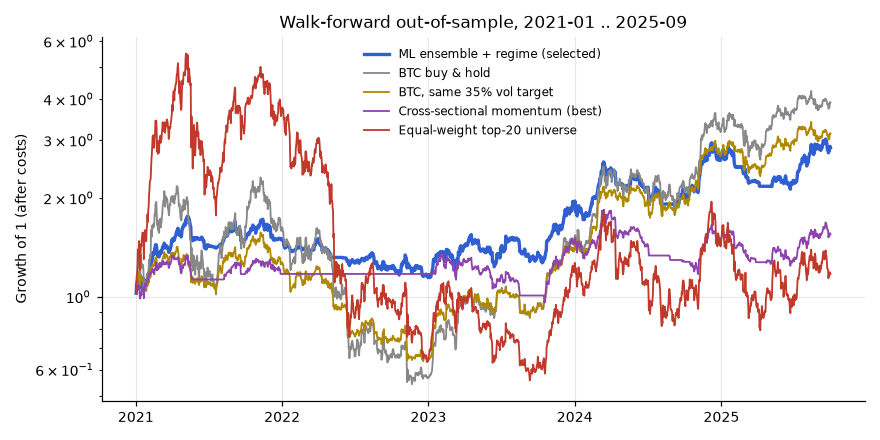
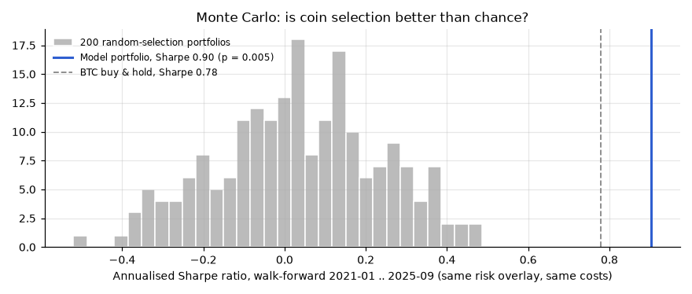
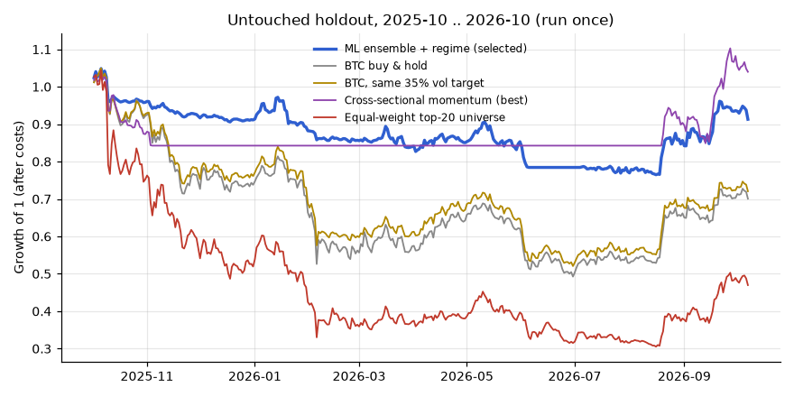
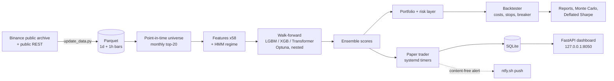

# Crypto ML Trading Research

A complete, bias-aware research pipeline for a **daily, long-only, multi-asset crypto strategy**
(Binance spot, point-in-time top-20 universe): data ingestion, 58 engineered features, HMM regime
detection, gradient-boosting + Transformer ensemble tuned with Optuna, walk-forward validation,
Monte Carlo / Deflated Sharpe significance tests, a risk layer, and a 24/7 paper-trading service
with a web dashboard.

> **Disclaimer.** This is a research project. It is **not investment advice** and it has
> **never been used with real money** - it places no orders and uses no exchange API keys.
> The honest result is that the strategy did **not** beat buying and holding Bitcoin on returns.



## Key findings

| | Result |
|---|---|
| Signal quality | Out-of-sample cross-sectional rank IC **0.14** (t ≈ 10) over 4.75 years - the models genuinely rank coins. Plain momentum: IC 0.014 (t = 1.1, not significant). |
| Selection skill | Beats **200 random-selection portfolios** run through the identical risk/cost machinery (p = 0.005). |
| Versus Bitcoin | **Did not beat BTC buy & hold** on return (CAGR 24.6% vs 33.2%). Higher Sharpe (0.90 vs 0.78) but the difference is **not statistically significant** (paired bootstrap: P(better) = 0.67). Main benefit: max drawdown −35% vs −77%. |
| Holdout (run once) | In the untouched final year (a bear market) the system lost **−8.7%** while BTC lost −29.9%. Still a loss. |
| Why the gap? | The edge is mostly *which coins will underperform* (high-volatility, "lottery" coins). A long-only, spot-only book can only avoid them, not short them, so it still carries market beta - and pays ~44% of starting capital in costs over 4.75 years. |

### Lessons learned (bugs I found in my own pipeline)
- **Inflated win rate.** The first report showed a 91% win rate. Root cause: round trips were
  tracked in *portfolio-weight* units, so a losing position whose weight had drifted down was never
  counted as "closed". Fixed by tracking units bought/sold → realistic **51%**.
- **Ticker reuse.** `LUNAUSDT` is Terra Classic until 2022-05-13 and Terra 2.0 from 2022-05-31.
  Stitching them would turn the old coin's final $0.00005 print into a fake ~20,000× gain when the new coin starts at $1. History is split at gaps > 7 days into
  separate assets (`LUNAUSDT@2022-05-31`) - while the real −99.99% collapse is kept.
- **Normalisation leak.** The Transformer's feature scaler was first fitted on the full sample;
  it now uses only data before the first test date.
- **Survivorship.** The universe is rebuilt every month from volume known *at that time*,
  including coins later delisted, so failures like LUNA and FTT are in the backtest.

## Methods

| Area | What is implemented |
|---|---|
| Point-in-time universe | Monthly top-20 USDT pairs by trailing 30-day volume, strictly before the month; delisted coins included; 90-day minimum history |
| Features (58) | Multi-horizon and volatility-adjusted momentum, realised / Parkinson / Garman-Klass vol from hourly bars, hourly skew & kurtosis, volume z-scores, taker-buy ratio, Amihud illiquidity, RSI/MACD/Bollinger derivatives, beta & correlation to BTC and to the market, relative strength, breadth, dispersion, BTC volume share. All cross-sectionally ranked |
| Regimes | 3-state Gaussian **HMM** (calm-up / range / stress), refitted per fold, using **forward-filtered** probabilities only (the smoothed posterior would leak the future) |
| Models | **LightGBM**, **XGBoost (CUDA)**, a small **Transformer encoder** (PyTorch, CUDA), and a rank-average **ensemble** weighted by each model's inner-validation IC |
| Tuning | **Optuna** TPE, nested inside each fold's training window; 410 trials in total, all counted |
| Validation | **Walk-forward**: expanding train window, 19 quarterly test folds (2021-01 … 2025-09), purge gap = label horizon, last 6 months of each train window as inner validation. **Holdout** 2025-10 … 2026-10 locked by a lock file and run exactly once |
| Statistics | Block bootstrap CIs, paired bootstrap vs benchmarks, random-selection **Monte Carlo**, **Deflated Sharpe Ratio** (Bailey & López de Prado) for 15 variants and for all 425 trials |
| Execution model | Decision at the daily close; fill at the next day's first-hour typical price. 0.10% fee + liquidity-dependent half-spread + slippage + square-root market impact; 2× and 3× cost stress tests |
| Risk layer | Inverse-volatility sizing to a 35% vol target, 20% per-asset cap, correlation-cluster cap, ATR stop-loss / take-profit, daily loss limit, 25% drawdown circuit breaker |
| Look-ahead tests | Unit tests perturb all future prices and assert that no past feature, label or regime probability changes |

## Results

Walk-forward out-of-sample period 2021-01-01 … 2025-09-30, net of all costs:

| Strategy | CAGR | Sharpe | Sortino | Max DD | Trades |
|---|---|---|---|---|---|
| **ML ensemble + regime overlay (selected)** | 24.6% | **0.90** | 1.31 | **−35.0%** | 2,294 |
| XGBoost + regime | 24.3% | 0.89 | 1.28 | −33.6% | 2,740 |
| Transformer + regime | 19.3% | 0.76 | 1.08 | −39.5% | 1,971 |
| LightGBM + regime | 17.2% | 0.68 | 0.98 | −33.3% | 2,743 |
| Cross-sectional momentum (best variant) | 9.6% | 0.48 | 0.71 | −36.4% | 1,520 |
| BTC buy & hold | **33.2%** | 0.78 | 1.16 | −76.5% | 1 |
| BTC scaled to the same 35% vol target | 27.2% | 0.84 | 1.26 | −59.4% | 642 |
| BTC 200-day trend filter | 20.8% | 0.64 | 0.97 | −65.9% | 45 |
| Equal-weight top-20 universe | 3.4% | 0.47 | 0.66 | −89.9% | 799 |

Robustness of the selected system:
- Bootstrap 90% CI for Sharpe: 0.08 … 1.65.
- Deflated Sharpe probability: 0.91 for the 15 variants, 0.82 when all 425 trials are counted. Neither reaches the usual 0.95 bar.
- Sharpe drops to 0.87 with 2× costs and to 0.62 with 3× costs.



**Final holdout**, 2025-10-01 … 2026-10-07. The configuration was committed to git before this run, and it was run once:

| Strategy | Return | Sharpe | Max DD |
|---|---|---|---|
| **Selected: ensemble + regime** | **−8.7%** | −0.34 | −27.1% |
| BTC buy & hold | −29.9% | −0.57 | −53.1% |
| BTC at the same vol target | −27.9% | −0.71 | −50.4% |
| Equal-weight universe | −53.0% | −0.87 | −70.7% |

The holdout IC stayed positive (0.10). However, the random-selection test was not significant over a single year (p = 0.13). A trend-filtered variant did better in the holdout (+6.8%), but choosing it after seeing those results would be data snooping, so it is reported and not selected.



## Architecture



```
src/traderbot/
  data.py         archive + REST download, integrity checks, relisting split
  universe.py     point-in-time monthly universe
  features.py     58 features, labels, timing convention
  regime.py       HMM with causal forward filtering
  models.py       LightGBM, XGBoost, Transformer, Optuna, ensemble
  walkforward.py  nested walk-forward driver
  strategy.py     signal -> weights, vol targeting, caps, regime exposure
  backtest.py     event-driven simulator with frictions and risk rules
  metrics.py      CAGR/Sharpe/Sortino/DD, bootstrap, Deflated Sharpe
  paper.py        paper trading against live bid/ask (no keys, no orders)
  dashboard.py    FastAPI + Plotly dashboard
scripts/          update_data, research, final_test, paper_ctl, make_report, make_figures
tests/            look-ahead and backtester tests
deploy/           systemd --user units
```

## Run it

Python 3.12. An NVIDIA GPU is optional; CPU works but is slower.

```bash
git clone <this repo> && cd crypto-ml-trading-research
python -m venv .venv && source .venv/bin/activate
pip install -r requirements.txt --extra-index-url https://download.pytorch.org/whl/cu128
pip install -e .
export TB_HOME=$PWD

python -m pytest -q                      # look-ahead + backtester tests
python scripts/update_data.py            # ~60 min first time, ~0.8 GB: all USDT pairs (daily) + candidates (hourly)
python scripts/research.py               # build features, walk-forward, backtests, Monte Carlo (~30 min on RTX 4060 Ti)
python scripts/make_report.py            # reports/report.html
python scripts/make_figures.py           # docs/img/*.png
```

The final holdout is guarded by `reports/HOLDOUT_USED.lock`. Delete that file only if you are
starting a fresh study with new data.

Paper trading and dashboard. Optional: put `NTFY_TOPIC` in `.env` to get phone alerts (see `.env.example`).

```bash
cp deploy/tb-*.service deploy/tb-*.timer ~/.config/systemd/user/   # units expect the repo at ~/trader-bot (%h = home)
systemctl --user daemon-reload
systemctl --user enable --now tb-daily.timer tb-hourly.timer tb-retrain.timer tb-dashboard.service
# open http://127.0.0.1:8050
```

**Data:** all market data comes from Binance's public archive at [data.binance.vision](https://data.binance.vision) and the public REST API. No API key is needed, and the data itself is not included in this repo.

## License
MIT. See [LICENSE](LICENSE).
